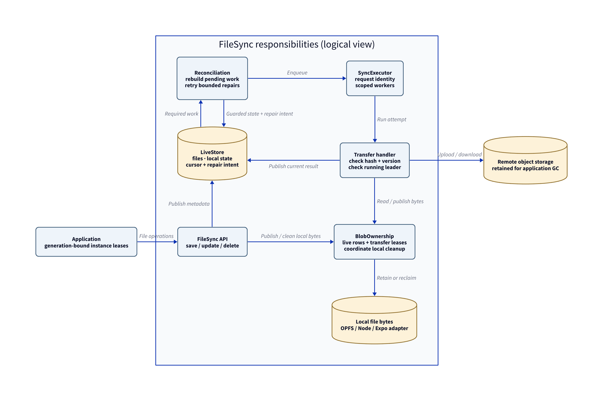
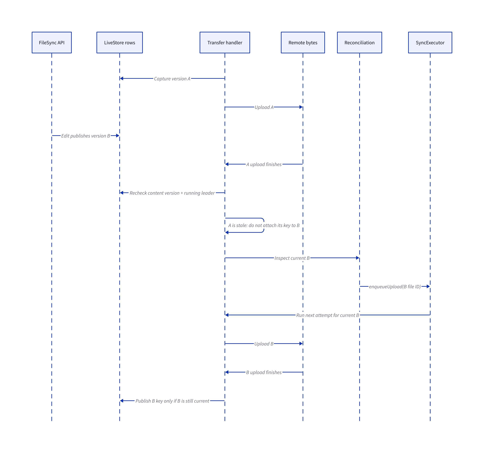

# FileSync correctness report — 9 September 2026

The correctness work is complete. Reviewed combined code: [68090cb](https://github.com/slashv/livestore-filesync/commit/68090cb78f86f7e6076a38c3a2b125704e391423), integrating correctness PRs #5–10 with the existing `main` compatibility fixes. Transfers now reject stale content, shared local bytes survive individual record deletion, persisted work recovers after restart, and lifecycle cleanup belongs to the instance that created it.

**What changed**

- **Transfers:** captured hash, path, remote key, deletion state and running generation guard progress and publication. Uploads and downloads verify bytes; checksum failures use bounded retries. `SyncExecutor` tracks request identity and schedules replacement work.
- **Ownership:** `BlobOwnership` protects live references and transfer leases, serializing local cleanup with publication. Remote objects are deliberately retained because clients cannot know about offline owners.
- **Recovery:** `Reconciliation` rebuilds queues from persisted queued/interrupted state. Failed inspections persist targeted `cursor.repairs` before cursor advancement, with bounded attempts. Warm recovery avoids full file rescans; heartbeat does not continually retry terminal transfer errors.
- **Lifecycle and thumbnails:** awaitable, serialized start/stop/dispose, generation-bound singleton leases and running-leader workers prevent old owners publishing into newer instances. Fetch, XHR and response-body cancellation propagate. URLs reject deleted or asynchronously superseded sources; thumbnail attempts guard source versions and track queue ownership per attempt. Final fixes also enforce client-only schema state and zero-fill filesystem truncate growth.



Logical responsibilities, not a deployment or cross-tab transaction diagram. LiveStore metadata can change outside the per-instance cleanup mutex. [Editable D2](2026-09-09-ownership.d2) · [SVG](2026-09-09-ownership.svg)

**Representative before/after scenarios**

| Trigger | Earlier failure risk | Current behavior |
|---|---|---|
| Edit B while upload A finishes | A's key could mark B complete | Reject A's publication; reconcile B |
| Delete one of two identical files | Shared bytes could disappear | Retain bytes referenced by the other row |
| Restart with advanced cursor | Persisted work could lack an executor task | Rebuild pending queues without rescanning done files |
| Dispose an old mount after reinitialization | Cleanup could target the replacement | Release only the original generation's lease |



One possible interleaving, assuming leadership continues and B needs upload. A's remote bytes remain retained. [Editable D2](2026-09-09-stale-upload.d2) · [SVG](2026-09-09-stale-upload.svg)

**Implementation call flows**

From [FileSync](../../packages/core/src/services/file-sync/FileSync.ts), [Reconciliation](../../packages/core/src/services/file-sync/Reconciliation.ts) and [BlobOwnership](../../packages/core/src/services/file-sync/BlobOwnership.ts):

```text
startSyncLoop
  → reconciliation.recover(true) → executor.enqueueUpload / enqueueDownload
  → reconciliation.repair
  → executor.resume / pause → executor.ensureWorkers
  → maybeBootstrapFromTables → startEventStream

transferHandler → blobs.duringTransfer
  upload: blobs.publish(localStorage.readFile) → doHashFile
          → remoteStorage.upload → currentTransfer → store.commit
  stale:  reconcileLatest → handleFileUpdated → reconciliation.reconcile
          → executor.enqueueUpload / enqueueDownload
  download: remoteStorage.download → doHashFile
            → blobs.publish(writeFile + guarded local state publication)
```

The integration preserves [#4](https://github.com/slashv/livestore-filesync/pull/4): cursor timestamps decode milliseconds or ISO strings, and repeated creates preserve later updates/deletions. Durable cursor repairs remain intact.

**Validation and review**

Validation of the combined revision passed `pnpm build:packages`, `pnpm check`, `pnpm lint` and the full `pnpm test`: **420 package tests**, Node adapter store-creation smoke, **35 React Chromium tests** and **11 thumbnail Chromium tests**. The main browser suite's 11 configured thumbnail skips run in the separate thumbnail suite.

Coverage includes controlled transfer races, cleanup ownership, restart/repair, lifecycle cancellation, mixed-stage refresh, cross-context thumbnails, OPFS staged-close abort and Expo native-module contracts. These exercise behavior; they do not prove every possible interleaving or physical-device behavior. Firefox was not run.

One earlier full run failed a console assertion on a handled upstream LiveStore `DEBUG PersistedSqliteError` during empty fast-path database startup, despite successful file display and transfer. The adapter falls back to a leader snapshot. Assertions were unchanged; the focused test and full rerun passed. Startup flakiness remains a limitation.

Each implementation PR received independent review; a second integration review covered transfers/repair, lifecycle/thumbnails and tests/adapters. The final fixes received a further clean independent review; the original integration reviewers confirmed their findings closed. Change trail: [#5 transfers](https://github.com/slashv/livestore-filesync/pull/5), [#6 ownership](https://github.com/slashv/livestore-filesync/pull/6), [#7 recovery](https://github.com/slashv/livestore-filesync/pull/7), [#8 lifecycle](https://github.com/slashv/livestore-filesync/pull/8), [#9 tests](https://github.com/slashv/livestore-filesync/pull/9), [#10 review fixes](https://github.com/slashv/livestore-filesync/pull/10).

**Intentional behavior and remaining limits**

Remote reclamation requires authoritative application/server garbage collection. Already-issued URLs cannot be retroactively revoked. Local cleanup is per-instance and best effort: filesystem failures can retain or orphan bytes. Noncancellable writes are joined, so an adapter that never settles can delay shutdown indefinitely.

Thumbnail source validation and automatic generation require `filesTable`; omitting it preserves legacy stored-state lookup. Same-generation singleton mounts keep the first configuration: dispose/reinitialize to change it, or use an `authToken` getter for credential refresh. See [stability guarantees](../STABILITY.md) and [thumbnail compatibility](../image-processing.md).
